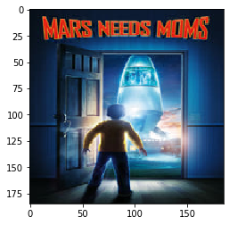

# Multi-Label Genre Classification of Movies From Their Posters

Drew Hatcher, Jahin Ahmed, Nikhil Rajan, Parker Bryant, and Zach Hussin

# Problem Statement

Movie posters can provide a lot of information for people going to see movies. Apart from the cast and crew, visual features and structural cues are guiding factors in classifying a movie genre. However since the idea for posters was first conceived, we have have a vast range of styles, ranging anywhere from minimalist graphic design to intricate composite photographs.To better understand the design choices behind movie posters, our project aims to create a classification model that is able to predict a movie’s genre based on features that it’s poster possesses. Prediction tools of this nature can be applied to areas such as detection of unwanted image content on platforms, categorising videos based on their thumbnails, and perhaps falicitating data for a discrinimator neutral network of a GANs in order to verfiy fake content. 

# Approach Overview

Our goal in this project was to create a supervised learning model that would accurately classify a movie's genre based on its poster. In order to do this, we needed to obtain genre classification and poster images for a significant amount of movies. We found a dataset of movie data that was harvested from TMDB and from that large dataset, we preprocessed the data to cut away unnecessary information and to fit the parameters of our model. From our preprocessed data, we created a smaller subset of the data in order to test potential models with efficiency. After extensive research, it was clear that convolutional neural networks are the most used and effective supervised learning technique for classify images. Finding this, we decided to create a cnn and then run experiments changing a single variable at a time to hone in on the overall most efficient and accurate classification model. Our final convolutional neural network is a -------------------------------------- ** EXPLANATION OF FINAL MODEL HERE ** ----------------------------------------

# Data Collection

After locking in on our problem, the next step in solving our problem was to find data around and relating to our project that we could use to build a model. Because of the specificity of our problem, there wasn't a bulk of readily available data from big name sources, so we turned to Kaggle, which is an online community dedicated to machine learning initiatives where a wide variety of datasets are collected and made public to the community. From Kaggle, we were able to find a catch all dataset for a set of over 40,000 movies. This dataset, called "The Movies Dataset" is described as an ensemble of data collected from TMDB using their public API. The dataset has almost 68,000 downloads and a usablity rating of 8.2. We decided the dataset would be a great fit for our problem based on the credibility of the source, the categorical data collected, and the sheer size of the set. 

The dataset we used can be found here: [The Movies Dataset](https://www.kaggle.com/rounakbanik/the-movies-dataset)

# Preprocessing

When deciding what dataset to use, we realized there would be a tradeoff between the quality of the data that we acquired and the time it would take to preprocess that data. Choosing to use The Movies Dataset gave us the highest quality and quality of data, but came at the cost of a significant amount of data preprocessing before we could even start building a model. We still decided upon using the dataset because we realized building a model with a low quality and quantity of data would give us an unreliable model, which in the end isn't worth the trouble. 

## Filtering Unuseful Information

From The Movies Dataset, we were able to narrow our usage to only movie metadata, but this still left us with an overwhelming amount of unnesessary information. The movie metadata was a csv file of over 45,000 columns and 24 rows. Each of these rows corresponded to an attribute about a movie, and here is a example of a row in that csv: 

| adult | belongs_to_collection | budget | genres | homepage | id | imdb_id | original_language | original_title | overview | popularity | poster_path | production_companies | production_countries | release_date | revenue | runtime | spoken_languages | status | tagline | title | video | vote_average | vote_count |
| --- | --- | --- | --- | --- | --- | --- | --- | --- | --- | --- | --- | --- | --- | --- | --- | --- | --- | --- | --- | --- | --- | --- | --- |
| FALSE | ``{'id': 10194, 'name': 'Toy Story Collection', 'poster_path': '/7G9915LfUQ2lVfwMEEhDsn3kT4B.jpg', 'backdrop_path': '/9FBwqcd9IRruEDUrTdcaafOMKUq.jpg'}`` | 30000000 | `` [{'id': 16, 'name': 'Animation'}, {'id': 35, 'name': 'Comedy'}, {'id': 10751, 'name': 'Family'}] `` | ``http://toystory.disney.com/toy-story`` | 862 | tt0114709 | en | Toy Story| ``Led by Woody, Andy's toys live happily in his room until...`` | 21.946943 | ``/rhIRbceoE9lR4veEXuwCC2wARtG.jpg`` | ``[{'name': 'Pixar Animation Studios', 'id': 3}]`` | ``[{'iso_3166_1': 'US', 'name': 'United States of America'}]`` | 10/30/1995 | 373554033 | 81 | ``[{'iso_639_1': 'en', 'name': 'English'}]`` | Released | N/A| Toy Story | FALSE | 7.7 | 5415 |

Obviously a large chunk of this data was unrelated and took up a lot of space, which would complicate things down the road trying to build the model. So immediately, our first thought was to create a new csv file that we could refer to later, that only contained the relevant movie attributes. Given our problem statement, we narrowed our neccessary or wanted attributes down to 'id', 'title', 'genre', and 'posterpath'. We kept the id column as it was needed to connect a movie to it's poster and genre. We found the title was useful to as it allowed us to test our data processing and ensure the data was still associated with the correct movie. Genre was obviously needed in order to train and test our model using the proper genres, and posterpath was just as important as it gave us access to the images we were analyzing. Afterwards, our data looked something like this:

| id | title | genres | posterpath |
| --- | --- | --- | --- |
| 862 | Toy Story | ``[{'id': 16, 'name': 'Animation'}, {'id': 35, 'name': 'Comedy'}, {'id': 10751, 'name': 'Family'}]`` | ``/rhIRbceoE9lR4veEXuwCC2wARtG.jpg`` |

## Removing Invalid Data

Once we had narrowed our dataset to only the essential information, we were able to closely analyze each piece of data to ensure its validity with higher efficiency. While the dataset is credible, we realized that since the dataset was created, many things could have changed, and even then, it's possible that not every movie's data was in good condition to be analyzed. Because of this, we came up with some minimum conditions for us to keep the data. The first of which was that each movie must have at least 1 associated genre, and a path to a poster image. To meet this restraint, we looped through the entire processed lists of movie and deleted any row that had a null posterpath or genre. This simple filtering alone dropeed around 5000 rows from dataset. 

While this restriction did most of the dirty work, there was still the possibility that some data was invalid as not all of the posterpaths mapped to a valid url with an image. To take care of this, when we collected our posters (detailed process described next), we were able to include checks that would make sure that not only the url was valid, but also that a proper jpg file could be created from that path. In doing this, we were able to collect the id of each movie that didn't have a valid poster, and directly dropped these rows from our processed csv. With these conditions, we were confident that our data was cleansed enough to be reliable in training.

## Binary Genre Conversion

In order to create a model to train, our genre's must be in a processable and stardardized format. Our genres were currently being read as a string of seemingly random characters that doesn't have any meaning to a neural network. To fix this problem, we decided to compose a list of all of the genres represented by our data, which turned out to only 20 genres. This required converting the string genre's into json objects and looping through to find unique genre values. We created a column for each genre, and looped through each row in our data, marking the genre columns with a 1 if the movie was of that genre and a 0 if not. Here is an example of how the genre's were classified for each movie:

| id | title | genres | posterpath | Animation | Comedy | Family | Adventure | Fantasy | Romance | Drama | Action | Crime | Thriller | Horror | History | Science Fiction | Mystery | War | Foreign | Music | Documentary | Western | TV Movie |
| --- | --- | --- | --- | --- | --- | --- | --- | --- | --- | --- | --- | --- | --- | --- | --- | --- | --- | --- | --- | --- | --- | --- | --- |
| 862 | Toy Story | ``[{'id': 16, 'name': 'Animation'}, {'id': 35, 'name': 'Comedy'}, {'id': 10751, 'name': 'Family'}]`` | ``/rhIRbceoE9lR4veEXuwCC2wARtG.jpg`` | 1 | 1 | 1 | 0 | 0 |	0 | 0 | 0 | 0 | 0 | 0 | 0 | 0 | 0 | 0 | 0 | 0 | 0 | 0 | 0 |

Once the binary classification was complete, it was aparent that for our model, the title, posterpath, and genre columns would not be needed in our model, and thus, we dropped those rows from the csv file. This left the id's of each movie corresponding to an index into the image numpy array, and columns of genre's to classify the images. 

## Poster Collection

Because we were still working with over 40,000 images, we knew that obtaining the images would be both time and space intensive, so instead of trying to do this every time we trained, we decided to collect all of the posters and host them locally in a saved array. Before we could do this, we first had to create a script that would loop through each posterpath and retrieve the image associated with that movie. We then saved each image as a jpg named by their corresponding id in a directory dedicated to poster images. As we did this, we were also adding each image to a numpy array that was then saved locally with a size of over 16 GB. Having this array locally allowed us to refer directly to a certain element during training, which drastically increased the speed of our model. 

## Image Compression

Understanding what we knew about locally hosting images, in terms of overall time and space complexity, we had to decide on the proper size for images. Our poster paths were url extenstions that accessed images from TMDB's web server. Using TMDB's api, we found that we could pass in a few different values in our url parameters and get different size images. After discussing as a group, we agreed that the larger the image, the marginal increase in information is much lower than the marginal time and space required to compensate that large image. Thus we went with the smallest poster image, that still gave clear and distinguishable shapes, settling upon images with a width of 185 pixels for each image. 

During our poster collection process, it came to our attention that there wasn't a standard height for the images that we were collecting. This could cause problems in our convolutional neural network, because a standard size is required for the model, and even if it wasn't, non standard data could throw off the results of our filtering in our convolutional layers. Thus, we decided in order to standardized our images, we would compress each image such that it's height was also 185 pixels. This way, shapes and details were still being captured similarly accross posters and it shouldn't affect the performance of our network. To compress the images, we used a load image function that is a part of the tensorflow keras image preprocessing library. This function uses a nearest neighbor interpolation strategy that replaces a group of pixels with a single pixel based on neighboring pixels and the ratio of the new size to the original size. With our newly sized 185x185 images, we realized that any further dimensionality reduction was unnessesary and could be harmful to the accuracy of our model. We now had a 4D array of an approximate size (40000, 185, 185, 3) to use for our training. 

